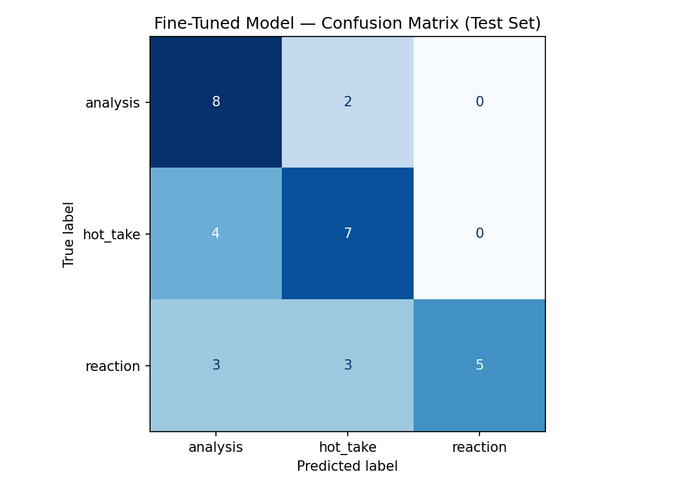

# TakeMeter

TakeMeter classifies public English-language 2026 World Cup discussion from Reddit's `r/soccer` community as `analysis`, `hot_take`, or `reaction`.

It compares Groq's zero-shot `llama-3.3-70b-versatile` baseline with a fine-tuned `distilbert-base-uncased` model on the same locked test set.

## Why r/soccer

Live football discussion combines tactical explanations, confident opinions, celebration, frustration, humor, and sarcasm in the same thread. This makes `r/soccer` a useful community for testing whether a classifier can separate reasoning from opinions and emotional reactions.

## Labels

| Label | Definition |
|---|---|
| `analysis` | Meaningful football reasoning about tactics, match events, player roles, rules, statistics, comparisons, or cause and effect. |
| `hot_take` | A strong opinion, criticism, praise, prediction, ranking, or judgment without enough meaningful explanation. |
| `reaction` | Emotion, humor, celebration, sarcasm, disbelief, wordplay, or a short response without a football argument. |

### Two examples per label

| Label | Example 1 | Example 2 |
|---|---|---|
| `analysis` | “Spain struggled because Cape Verde stayed organized in a low block and Spain could not create space.” | “Germany struggled because they left too much space behind their fullbacks.” |
| `hot_take` | “Uruguay are a mediocre team now.” | “Brazil are the most overrated team in the tournament.” |
| `reaction` | “The World Cup of draws.” | “WHAT A GOAL!” |

## Dataset and annotation process

The dataset contains **210 manually annotated public English-language comments** from 2026 FIFA World Cup-related `r/soccer` match and post-match threads.

```text
data/world_cup_comments.csv
```

| Label | Examples |
|---|---:|
| `analysis` | 70 |
| `hot_take` | 70 |
| `reaction` | 70 |
| **Total** | **210** |

Each CSV row contains `id,text,label,notes`.

I manually collected, labeled, and reviewed every final example. I used `analysis` only when a reason was specific and meaningful. A broad opinion with a shallow reason remained `hot_take`. Short emotional, humorous, and sarcastic comments were labeled `reaction`.

I excluded usernames, vote counts, ads, promoted content, other subreddits, club football, historical World Cups, pre-tournament friendlies, unrelated politics, slurs, and comments that could not be reliably classified from their text.

### Difficult annotation decisions

| Comment | Label | Reason |
|---|---|---|
| “Germany are awful because they lost.” | `hot_take` | “Because they lost” is too shallow to be meaningful analysis. |
| “Germany struggled because they left too much space behind their fullbacks.” | `analysis` | It gives a concrete tactical cause. |
| “As a lifelong Germany fan for the past 90 minutes, this means so much” | `reaction` | It is sarcastic humor, not a football argument. |

## Data split

A stratified split with seed `42` produced:

| Split | Examples | Purpose |
|---|---:|---|
| Training | 147 | Fine-tune DistilBERT |
| Validation | 31 | Select the best checkpoint |
| Test | 32 | Final evaluation for both models |

The locked test set has 10 `analysis`, 11 `hot_take`, and 11 `reaction` examples.

## Models

### Zero-shot baseline

The baseline used Groq's `llama-3.3-70b-versatile`. All 32 baseline responses were parseable.

```text
You are classifying public English comments from r/soccer about FIFA World Cup matches.

Assign every comment to exactly one label.

analysis:
The comment gives meaningful football reasoning. It explains tactics, match events, player roles, rules, statistics, cause and effect, or compares why something happened.
Example: "Spain struggled because Cape Verde stayed organized in a low block and Spain could not create space."

hot_take:
The comment gives a strong opinion, criticism, praise, prediction, ranking, or judgment without enough meaningful explanation.
Example: "Uruguay are a mediocre team now."

reaction:
The comment is mainly emotion, humor, celebration, disbelief, sarcasm, wordplay, or a short response without a football argument.
Example: "The World Cup of draws."

Respond with ONLY one exact label:
analysis
hot_take
reaction
```

### Fine-tuned model

The classifier uses `distilbert-base-uncased`.

| Setting | Value |
|---|---|
| Epochs | 8 |
| Learning rate | `2e-5` |
| Training batch size | 16 |
| Evaluation batch size | 32 |
| Weight decay | `0.01` |
| Warmup ratio | `0.1` |
| Random seed | 42 |
| Best checkpoint selection | Validation accuracy |

## Evaluation results

| Model | Accuracy | Correct predictions |
|---|---:|---:|
| Groq zero-shot baseline | **0.906** | **29 / 32** |
| Fine-tuned DistilBERT | **0.625** | **20 / 32** |

Fine-tuned DistilBERT scored **28.12 percentage points lower** than the Groq baseline. This is an honest result: fine-tuning a smaller classifier on 147 examples did not outperform the larger instruction-following model on nuanced informal comments.

Saved aggregate metrics: `outputs/evaluation_results.json`.

### Per-class metrics: Groq baseline

| Label | Precision | Recall | F1-score | Support |
|---|---:|---:|---:|---:|
| `analysis` | 1.00 | 0.90 | 0.95 | 10 |
| `hot_take` | 0.90 | 0.82 | 0.86 | 11 |
| `reaction` | 0.85 | 1.00 | 0.92 | 11 |
| **Accuracy** |  |  | **0.91** | **32** |

### Per-class metrics: fine-tuned DistilBERT

| Label | Precision | Recall | F1-score | Support |
|---|---:|---:|---:|---:|
| `analysis` | 0.53 | 0.80 | 0.64 | 10 |
| `hot_take` | 0.58 | 0.64 | 0.61 | 11 |
| `reaction` | 1.00 | 0.45 | 0.62 | 11 |
| **Accuracy** |  |  | **0.62** | **32** |

## Confusion matrices

Rows are true labels; columns are predicted labels.

### Groq baseline

| True \ Predicted | `analysis` | `hot_take` | `reaction` |
|---|---:|---:|---:|
| `analysis` | 9 | 1 | 0 |
| `hot_take` | 0 | 9 | 2 |
| `reaction` | 0 | 0 | 11 |

### Fine-tuned DistilBERT

| True \ Predicted | `analysis` | `hot_take` | `reaction` |
|---|---:|---:|---:|
| `analysis` | 8 | 2 | 0 |
| `hot_take` | 4 | 7 | 0 |
| `reaction` | 3 | 3 | 5 |



## Sample fine-tuned predictions

| Comment | True label | Prediction | Confidence | Interpretation |
|---|---|---|---:|---|
| “Uruguay is always fools gold like Belgium is. Very talented players but that team washes out sooner or later” | `hot_take` | `analysis` | 0.48 | Broad judgment plus a small explanation was treated as reasoning. |
| “As a lifelong Germany fan for the past 90 minutes, this means so much” | `reaction` | `analysis` | 0.46 | Sarcasm was mistaken for serious commentary. |
| “This will always happen to Spain until they learn to beat a low block” | `analysis` | `hot_take` | 0.44 | Concise tactical explanation sounded like an unsupported opinion. |
| “The Saudis were like a fortress under siege at the end.” | `reaction` | `hot_take` | 0.41 | Figurative emotional language was not recognized as a reaction. |

## Error analysis

The main failure pattern is the boundary between concise analysis, strong opinion, and sarcasm. The model recovered most analysis comments (recall 0.80), but it detected only 5 of 11 reactions (recall 0.45). When it did predict `reaction`, it was correct, but it predicted that class too rarely.

## Reflection

### What the model learned

DistilBERT learned some useful signals for tactical reasoning and produced reliable reaction predictions when it chose that label. However, it overused explanation-like sentence structure as evidence of `analysis`, even when a comment was sarcasm or a broad opinion.

### How the specification guided the work

The specification required a balanced dataset and a locked test set, which prevented cherry-picking favorable results. The plan originally defined success as fine-tuning beating the baseline; the implementation differed because it did not happen. I kept the same test set and reported the regression instead of changing the evaluation after seeing the results.

### AI usage disclosure

1. I used AI to stress-test ambiguous boundaries between concise tactical analysis and unsupported opinions.
2. I used AI to help organize the README and error-analysis writing after the actual notebook outputs were available.

I manually reviewed final labels and exclusions, checked the saved model outputs, and did not use AI-generated comments as training data.

## Repository structure

```text
ai201-project3-takemeter/
├── data/
│   └── world_cup_comments.csv
├── notebooks/
│   └── takemeter_final_experiment.ipynb
├── outputs/
│   ├── confusion_matrix.png
│   └── evaluation_results.json
├── planning.md
└── README.md
```

## Run the experiment

1. Open `notebooks/takemeter_final_experiment.ipynb` in Google Colab.
2. Select a **T4 GPU** runtime.
3. Upload `data/world_cup_comments.csv`.
4. Add `GROQ_API_KEY` through Colab Secrets.
5. Run the cells in order.

## Ethical notes

- The dataset contains only public `r/soccer` comments.
- Usernames, voting information, advertisements, and unrelated thread content were excluded.
- Comments containing slurs or harmful content were excluded.
- This project is for educational analysis of public football discussion and is not intended to judge individual users.
